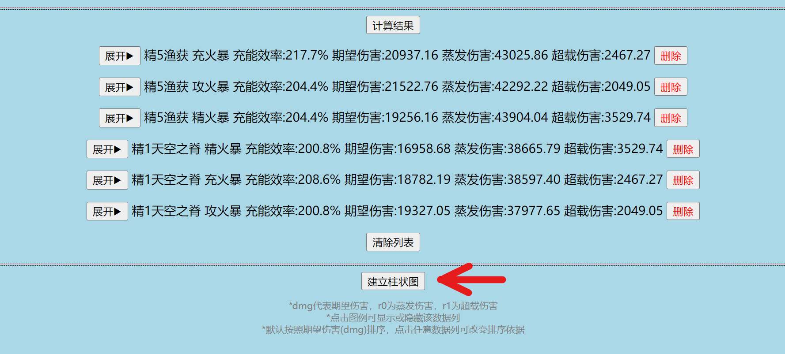

# 卯师傅的军火库

*一个致力于解决 **“香菱分枪”** 这一萌新难题的小工具。*
## 工具说明：
*还在为香菱的装备发愁？来卯师傅的军火库逛逛吧，包您满意！*

此工具以90级的香菱+绝缘4件套为基础模板，搜罗了香菱的各种常用武器，以柱状图的形式为您直观地列出各种武器的**理论**输出比较。

**注：此工具计算的数值仅作为在接近理想状态下互相比较的标准，不代表实际伤害**

**NGA原帖：**<a href="https://nga.178.com/read.php?tid=28662653">香菱分枪：香菱武器哪家强？——卯师傅的军火库</a>

## 食用方法：

1. 选择武器
2. 按需填入班尼特数值
3. 选择圣遗物的主属性
4. 填入自己能保证循环的最低充能效率
5. 填入目标词条数
6. 计算结果

计算所得的结果将被展示在按钮下方区域：

点击 **“展开”** 可以看到详细的面板数据；不小心误操作也没问题，点击 **“删除”** 即可除掉词条数据，或者点击 **“清除列表”** 来一键清屏。
## 直观的图表展示：

有了数据之后，点击“建立柱状图”即可依照以上数据建立柱状图：

默认依照“期望伤害”排序，**点击柱状图**即可依照对应数据列排序。
觉得某列数据碍眼，**点击右上角图例**即可切换隐藏/显示对应数据列。
需要计算其他数据时，在计算完成后 **点击“更新柱状图”** 即可依照新数据更新图表。
## 详细设定：
1. 此工具千岩采用两层特效，决斗采用两特效的平均值，薙刀已经计算释放元素爆发之后附加的元素充能。
2. 每词条数值：攻击 = 5.0%，充能 = 5.5%，暴击 = 3.3%，暴伤 = 6.6%，精通 = 19.8。
3. 默认的班尼特数值为71级+天空之刃+11级q所提供的数值。

## 运行原理：
此工具参考<a href="https://nga.178.com/read.php?tid=33107048">《全角色收益曲线》3.0重制版</a>中的**香菱属性收益曲线**：

采用如下词条分配机制：
1. 优先保证循环
2. 配平双暴
3. 把精通堆到155以上
4. 在精通达到阈值(306)之前，按照4双暴+1精通的顺序分配剩余词条，并尽可能保证暴击：暴伤≈1：2

**注意，这种近理想状态下的词条分配很容易让人忽视圣遗物的获取难度，在决定武器前请慎重考虑这一点。**

## 工具使用小技巧：
填数值时大可不必可钉可卯，可以根据实际情况来灵活选择词条、最低充能等数值，比如使用西风枪、十文字这类额外充能的武器时，计算的时候可以适当降低“最低充能”；再比如我有3精千岩长枪，在两层特效下，3精比1精高了大约2个词条，你就可以把1精的千岩抬高两个词条来大致估测出3精的伤害。